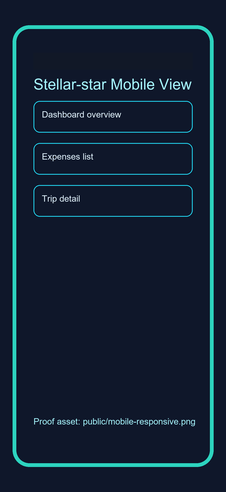

<p align="center">
  <a href="https://stellar-star-five.vercel.app/">
    <picture>
     <source media="(prefers-color-scheme: light)" srcset="https://img.shields.io/badge/%E2%AD%90_Stellar--star-Split_Bills._Pay_On--Chain.-0F0F14?style=for-the-badge&labelColor=white&color=2DD4BF" />
      
    </picture>
  </a>
</p>

<div align="center">
  <div style="display: inline-flex; align-items: center; justify-content: center; gap: 10px; background: white; border-radius: 16px; padding: 24px 40px;">
    <span style="font-size: 1.5rem; line-height: 1;">⭐</span>
    <h2 style="margin: 0;"><span style="color: #0F0F14;">Stellar</span><span style="color: #2DD4BF;">-Star</span></h2>
  </div>
</div>

<h1 align="center">⚡ Stellar-star — Split Bills. Pay On-Chain.</h1>

<p align="center">
  <em>Decentralized expense splitting on Stellar Testnet.</em><br/>
  Create expenses, split by equal/percentage/weight, and settle shares<br/>
  with real XLM transfers and verifiable transaction hashes.
</p>

<p align="center">
  <a href="https://stellar-star-five.vercel.app/"></a>
  &nbsp;
  <a href="https://youtu.be/Lh3TgpQHMng?si=dfwqbK7LiI2gAdQt"></a>
  &nbsp;
  <a href="https://github.com/Soumen1080/stellar-star"></a>
  &nbsp;
  <a href="https://github.com/Soumen1080/stellar-star/actions/workflows/ci.yml"></a>
</p>

<br/>

---

## Table of Contents

| # | Section |
|---|---------|
| 1 | [📖 Project Description](#project-description) |
| 2 | [✨ Features](#features) |
| 3 | [🛠️ Tech Stack](#tech-stack) |
| 4 | [📸 Screenshots](#screenshots) |
| 5 | [🔄 How It Works](#how-it-works) |
| 6 | [📜 Smart Contract](#smart-contract) |
| 7 | [✅ Submission Checklist Evidence](#submission-checklist-evidence) |
| 8 | [🚀 Quick Start](#quick-start) |
| 9 | [🔐 Environment Variables](#environment-variables) |
| 10 | [🧪 Testing](#testing) |
| 11 | [🚢 Deployment](#deployment) |
| 12 | [📁 Project Structure](#project-structure) |
| 13 | [📚 Documentation](#documentation) |
| 14 | [📄 License](#license) |

---

## Project Description

> **Stellar-star** solves the common *"IOU but no payment"* problem in group expense apps.

Most split apps only track debts. **Stellar-star closes the loop** by letting members settle instantly with XLM and verify results on-chain.

Every payment can be traced through an explorer transaction hash, and settlement metadata is stored via Soroban contract calls for **transparency** and **dispute resistance**.

### 🔑 Core Properties

| Property | Description |
|----------|-------------|
| 🔐 **Non-custodial** | Users sign with their own wallet |
| 🔗 **On-chain verifiable** | Each payment has a real tx hash |
| 💼 **Multi-wallet UX** | Freighter, xBull, Lobstr support |
| ⚡ **Realtime sync** | Supabase updates shared state across participants |

---

## Features

| Feature | Status |
|---------|--------|
| Multi-wallet connect (Freighter, xBull, Lobstr) | ✅ Live |
| Expense split modes (equal, percentage, weighted/custom) | ✅ Live |
| Per-share XLM settlement flow | ✅ Live |
| Soroban duplicate-settlement checks (`is_paid`) | ✅ Live |
| On-chain payment recording (`record_payment`) | ✅ Live |
| Transaction hash receipt links | ✅ Live |
| SEP-0007 QR generation | ✅ Live |
| Trip net-balance optimization | ✅ Live |
| Realtime sync (Supabase + contract events) | ✅ Live |
| Responsive mobile-first UI | ✅ Live |

---

## Tech Stack

| Layer | Technology |
|-------|------------|
| **App Framework** | Next.js 15 (App Router) + TypeScript |
| **UI** | Tailwind CSS, Framer Motion, Radix UI |
| **Blockchain** | @stellar/stellar-sdk, Horizon, Soroban RPC |
| **Smart Contract** | Rust + soroban-sdk |
| **Data Sync** | Supabase (PostgreSQL + Realtime) |
| **Testing** | Jest + ts-jest + React Testing Library |

---

## Screenshots

<details>
<summary><strong>📱 Mobile Views</strong></summary>
<br/>

### Landing Page on Phone


### Dashboard on Phone


### Mobile responsive proof



</details>

<details>
<summary><strong>🏠 Landing Page</strong></summary>
<br/>


</details>

<details>
<summary><strong>📊 Dashboard</strong></summary>
<br/>


</details>

<details>
<summary><strong>💰 Expenses Page</strong></summary>
<br/>


</details>

<details>
<summary><strong>🧳 Trips Page</strong></summary>
<br/>


</details>

<details>
<summary><strong>📝 New Expense Form</strong></summary>
<br/>


</details>

<details>
<summary><strong>🧪 Test Output</strong></summary>
<br/>


</details>

---

## How It Works

```
┌─────────────┐    ┌──────────────┐    ┌──────────────┐    ┌───────────────┐
│   Connect    │───▶│    Create     │───▶│  Choose Split │───▶│   Calculate   │
│   Wallet     │    │   Expense    │    │     Mode     │    │    Shares     │
└─────────────┘    └──────────────┘    └──────────────┘    └───────┬───────┘
                                                                   │
                   ┌──────────────┐    ┌──────────────┐    ┌───────▼───────┐
                   │  Sync State  │◀───│  Record on   │◀───│  Build/Sign   │
                   │  via Events  │    │   Soroban    │    │  & Submit TX  │
                   └──────────────┘    └──────────────┘    └───────────────┘
```

### 📋 Step-by-Step Flow

| Step | Action |
|------|--------|
| **1** | User connects wallet (Freighter / xBull / Lobstr) |
| **2** | Expense is created with split strategy and participant weights |
| **3** | App computes each member's share in XLM |
| **4** | Payment transaction is built client-side and signed in wallet |
| **5** | Signed envelope is submitted to Horizon |
| **6** | Contract read/write checks enforce no duplicate settlement |
| **7** | UI updates from tx hash receipts, event polling, and realtime sync |

---

## Smart Contract

> Latest deployed settlement contract (this workspace session):

| Detail | Value |
|--------|-------|
| **Contract ID** | `CBS2BJQ4ZC2ZSAZ5XS47BGC6Q7VTMJA4SE2PVHFXGXAZI5ES6H645WHO` |
| **Deploy Transaction** | [View on Stellar Expert](https://stellar.expert/explorer/testnet/tx/4d0304dc8b176aac73686f4590dbe883df9fc555aa3a41a6e6462a285abff8e4) |
| **Contract Explorer** | [View Contract](https://stellar.expert/explorer/testnet/contract/CBS2BJQ4ZC2ZSAZ5XS47BGC6Q7VTMJA4SE2PVHFXGXAZI5ES6H645WHO) |

### ✅ Verified On-Chain Transactions

| Transaction | Link |
|-------------|------|
| Settlement deploy tx | [View](https://stellar.expert/explorer/testnet/tx/826092e11281bd8fe3c8997ef0a4886b1bd3728069c6855ec4e3866f0a8f9d06) |
| Pool deploy tx | [View](https://stellar.expert/explorer/testnet/tx/fa245da3ce0a478a9146cccdfa0b1b7f918985c0c138dec3f061f104e5b8f39e) |
| Pool init tx (`pool_ini`) | [View](https://stellar.expert/explorer/testnet/tx/a04a0a2f79e06448156b52ebd07060281cab5bee323889e92c584e0aaf50546d) |
| Settlement init tx (`stx_ini`) | [View](https://stellar.expert/explorer/testnet/tx/f05c2f59f980a00e99f3f00d57e22b8b10fd0405064096273fd912c9b05a037e) |
| Inter-contract settlement proof (`record_payment` + internal pool `withdraw`) | [View](https://stellar.expert/explorer/testnet/tx/04c679c7ab7ec960db505038b4c6ec1f367e5d3caae013696bf3111e493de967) |

### 🔧 Main Contract Functions

```rust
record_payment(trip_id, expense_id, payer, member, amount, tx_hash)
get_payments(trip_id)
is_paid(expense_id, member)
```

### 💰 Settlement Pool Contract

SettleX employs a pool contract architecture where member balances are tracked. When recording a payment on-chain, the settlement contract calls the pool contract to withdraw the member's share amount:
- **`deposit(member, amount)`**: Allows any member to deposit mock pool credits for themselves (requires member's signature).
- **`withdraw(from, amount)`**: Withdraws credit from a member (requires member's signature).
- **`balance_of(member)`**: Returns the current mock pool credit balance for a member.

### 🛡️ Contract Guarantees

- ✅ **Prevent duplicate settlement** for same expense/member pair
- ✅ **Persist immutable settlement evidence** (`tx_hash`)
- ✅ **Return payment history** by trip for reconciliation

### ⚠️ Frontend-Handled Contract Errors

| Error Code | Name | Description |
|------------|------|-------------|
| `#1` | `InvalidAmount` | Amount is zero or negative |
| `#2` | `AlreadyPaid` | Duplicate settlement attempt |
| `#3` | `EmptyId` | Missing trip or expense identifier |

---

## Submission Checklist Evidence

| Requirement | Evidence |
|-------------|----------|
| Public repository | [GitHub Repo](https://github.com/Soumen1080/stellar-star) |
| Live demo | [stellar-star-soumen1080s-projects.vercel.app](https://stellar-star-soumen1080s-projects.vercel.app/) |
| Demo video | [YouTube](https://youtu.be/gnUaUONmb3I) |
| Contract details and tx proof | [Smart Contract](#-smart-contract) section |
| UI screenshots | [Screenshots](#-screenshots) section |
| Mobile screenshot proof | `public/mobile-responsive.png` |
| Test output screenshot | `public/testcase.png` |
| Release/runbook/proof docs | [Documentation](#-documentation) section |

---

## Quick Start

### Prerequisites

| Requirement | Version |
|-------------|---------|
| Node.js | 18+ |
| npm | 9+ |
| Rust toolchain | Latest (for contract work) |
| Stellar CLI | Latest (for contract deploy) |
| Freighter wallet | Set to **Testnet** |

### Install and Run

```bash
# 1. Install dependencies
npm install

# 2. Start the dev server
npm run dev
```

> Open [http://localhost:3000](http://localhost:3000) in your browser.

**First time setup?**

```bash
# Copy the environment template
cp .env.local.example .env.local
```

Then:
1. Add your Supabase URL and anon key to `.env.local`
2. Ensure your wallet is on Stellar Testnet

---

## Environment Variables

Use `.env.local` (or copy from `.env.local.example`):

```env
# ── Stellar Network ──────────────────────────────
NEXT_PUBLIC_STELLAR_NETWORK=TESTNET
NEXT_PUBLIC_HORIZON_URL=https://horizon-testnet.stellar.org
NEXT_PUBLIC_STELLAR_EXPLORER=https://stellar.expert/explorer/testnet

# ── Soroban / Smart Contract ─────────────────────
NEXT_PUBLIC_SOROBAN_RPC_URL=https://soroban-testnet.stellar.org
# Deployed contract ID (example or placeholder)
NEXT_PUBLIC_CONTRACT_ID=CBS2BJQ4ZC2ZSAZ5XS47BGC6Q7VTMJA4SE2PVHFXGXAZI5ES6H645WHO

# ── Supabase ─────────────────────────────────────
NEXT_PUBLIC_SUPABASE_URL=https://your-project.supabase.co
NEXT_PUBLIC_SUPABASE_ANON_KEY=your-anon-key-here
# Supabase JWT secret used for server-side auth challenge signatures
SUPABASE_JWT_SECRET=your-supabase-jwt-secret-here

# ── App Metadata ─────────────────────────────────
NEXT_PUBLIC_APP_NAME=Stellar-star
NEXT_PUBLIC_APP_VERSION=1.0.0
NEXT_PUBLIC_SITE_URL=http://localhost:3000
```

---

## Testing

**Run all frontend/unit tests:**

```bash
npm test -- --runInBand
```

**Generate coverage report:**

```bash
npm run test:coverage
```

**Current status in this workspace:**
- Run `npm test -- --runInBand` to see the latest total suites/tests after any new test cases are added.
- Run `npm run lint`, `npx tsc --noEmit`, and `npm run build` for release checks.

**For Rust contract checks:**

```bash
cd contract
cargo check
# optional
cargo test
```

### 📝 Pre-Release Verification Checklist

| # | Command | Purpose |
|---|---------|---------|
| 1 | `npm run lint` | Lint checks |
| 2 | `npx tsc --noEmit` | Type checking |
| 3 | `npm test -- --runInBand` | Run tests |
| 4 | `npm run build` | Production build |
| 5 | `cd contract && cargo check` | Rust contract check |

---

## Deployment

### App Build

```bash
npm run build
npm run start
```

### Contract Deploy (Stellar Testnet)

**Script:**

```bash
bash scripts/deploy-contract.sh <stellar-cli-account-alias-or-secret>
```

**Example:**

```bash
bash scripts/deploy-contract.sh settlex-deployer
```

**After deployment**, update:
- `NEXT_PUBLIC_CONTRACT_ID` in `.env.local`

> **Notes:**
> - If script is not executable in your shell, run it via `bash scripts/deploy-contract.sh <alias-or-secret>`.
> - Always verify returned tx/contract ID on Stellar Expert before updating docs.

---

## Project Structure

```
stellar-star/
│
├── 📂 app/                → Next.js app routes
├── 📂 components/         → UI and feature components
├── 📂 context/            → React context providers
├── 📂 hooks/              → App hooks (wallet, payment, events, etc.)
├── 📂 lib/                → Utilities, Stellar integration, Supabase client
├── 📂 contract/           → Soroban Rust smart contract
├── 📂 __tests__/          → Jest test suites
├── 📂 docs/               → Runbook, checklist, architecture, requirement matrix
├── 📂 scripts/            → Deployment scripts
└── 📂 types/              → Shared TypeScript types
```

---

## Documentation

| Document | Link |
|----------|------|
| Release Checklist | [RELEASE_CHECKLIST.md](docs/RELEASE_CHECKLIST.md) |
| Production Runbook | [RUNBOOK.md](docs/RUNBOOK.md) |
| Requirement Proof Matrix | [REQUIREMENT_PROOF_MATRIX.md](docs/REQUIREMENT_PROOF_MATRIX.md) |
| Architecture and Limitations | [ARCHITECTURE_AND_LIMITATIONS.md](docs/ARCHITECTURE_AND_LIMITATIONS.md) |

---

## License

**MIT** (2026) Stellar-star
